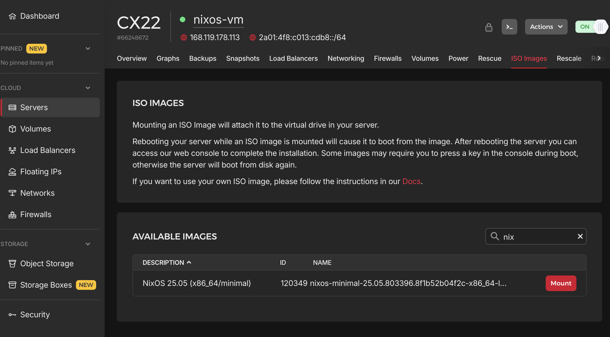
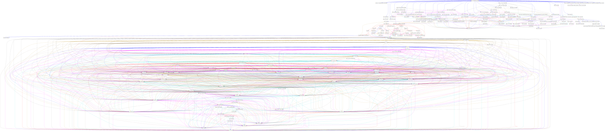
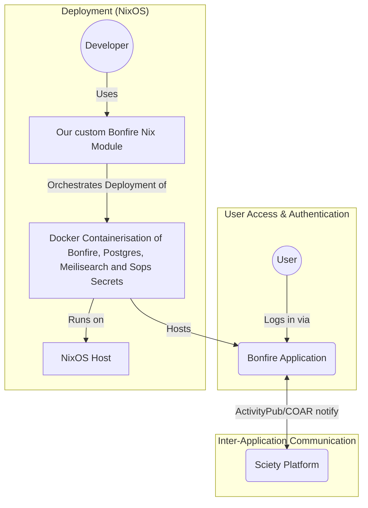

# 1b. nixOS and Bonfire deployment experiments and documentation

Following on from the work in [1a. Comparative research of deployment options](./1a.md), this work documents our experiments in deploying NixOS for Bonfire networks.

## Initial Experiment: Installing from ISO

Our first experiment followed the standard NixOS documentation for manual ISO installation.

### Installation process

Following [NixOS documentation for ISO installation](https://wiki.nixos.org/wiki/Install_NixOS_on_Hetzner_Cloud#Traditional_ISO_installation):

1. **Mount NixOS ISO**:
   - Navigate to ISO Images tab in your server console
   - Search for NixOS image and click "Mount"
   
   - Go to Power tab and click "Power cycle"

2. **Access console**: Click the console view button (`>_`) to enter the console. You're automatically logged in as the `nixos` user with sudo privileges.

3. **Partition and format drive**: Follow  NixOS [partitioning](https://nixos.org/manual/nixos/stable/#sec-installation-manual-partitioning) and [formatting](https://nixos.org/manual/nixos/stable/#sec-installation-manual-partitioning-formatting) procedures.

4. **Install and generate configuration**: Follow the installation proncess and create the initial system configuration:

```bash
nixos-generate-config --root /mnt
```

This generates two files:
- `configuration.nix` (main system configuration)
- `hardware-configuration.nix` (hardware-specific settings detected automatically)

Example configuration files generated in our experiments are available at:
- [configuration.nix](https://github.com/themarkness/nix-playground/blob/main/nixos/configuration.nix.old)
- [hardware-configuration.nix](https://github.com/themarkness/nix-playground/blob/main/nixos/hardware-configuration.nix)

### Key Findings from manual installation

- **Platform Considerations**: Nix development centers around Linux. Working on macOS requires additional tools like UTM for virtual machines. A Linux development environment is preferable for Nix work.

- **Evolving Syntax**: AI tools like Cursor LLM may have outdated context, resulting in mixed old and new syntax in generated configurations. Caution is advised when using AI assistance.

- **Documentation Complexity**: Documentation is highly technical, confirming our anticipated need to unpack concepts and provide accessible onboarding materials.

- **Installation Complexity**: The process involves multiple manual steps (boot from ISO, partition, format, install), but automation tools like `nixos-anywhere` and `nixos-infect` can help streamline deployment.

## Automated Deployment with nixos-anywhere

While NixOS is designed as a declarative system, traditional ISO installation still requires manual partitioning, filesystem creation, and initial bootstrapping. These steps are time-consuming and error-prone when deploying multiple systems.

The [community documentation](https://wiki.nixos.org/wiki/Install_NixOS_on_Hetzner_Cloud#nixos-anywhere) provides further options for NixOS deployment using command line utitilities; nixos-anwyhere and nixos-infect. The latter of the two is designed to convert an existing Linux installation, but may leave remnants of the system behind and is geared towards experimentation. For our purposes, we want to ensure reproducibility and scalability, so we are documenting use of [nixos-anywhere](https://github.com/nix-community/nixos-anywhere).

The `nixos-anywhere` tool addresses manual install limitations by automating the entire installation process remotely over SSH. It handles:
- Disk partitioning
- Filesystem setup  
- Initial NixOS installation based on declarative configuration files

This eliminates manual ISO-based installations and enables truly declarative deployment from start to finish.

Our objective was to transform a standard Linux VM into a fully configured NixOS environment with a single command, expressing all services, users, security settings, and data management in declarative Nix code.

Our first working version achieved the basics: disko could reliably partition the VM, and NixOS modules handled services and containers. But the process still required several manual steps around secrets and key management which in typical deployments use [Just](https://docs.bonfirenetworks.org/just.html), which would require us to drop out of the nix setup.

Once the core flow was automated, we focused on security and usability: SSH key-only access, disabling root login, enabling fail2ban, a minimal firewall, and provisioning user accounts with correct group memberships. These elements are all expressed declaratively in the Nix configuration, meaning they’re applied consistently at every deployment.

### Deployment Instructions

Here's our streamlined deployment process:

1. **Create Hetzner VM**: Set up a Debian or Ubuntu VM following the procedures outlined in previous sections
2. **Add SSH Key**: Include your SSH key during server creation
3. **Clone Repository**: 
```bash
git clone https://github.com/fishinthecalculator/bonfire-sciety-hetzner-vm
```
4. **Deploy**:
```bash
nix run github:nix-community/nixos-anywhere -- --flake $(pwd)#nixos-vm --generate-hardware-config nixos-generate-config $(pwd)/hardware-configuration.nix --target-host root@159.69.185.71
```

Within minutes, the VM is rebuilt as NixOS with proper partitioning, security configuration, and specified services. All changes are tracked in version control, making updates and environment replication straightforward.

### Configurations

- **Exploratory configuration**: [bonfire-nix](https://github.com/fishinthecalculator/bonfire-nix)
- **Sciety-focused deployment**: [bonfire-sciety-hetzner-vm](https://github.com/fishinthecalculator/bonfire-sciety-hetzner-vm)


Based on these experiments, we deployed a Sciety-specific working configuration which serves as a concrete reference deployment. We intend to continue developing and maintaining this work.

Although our immediate motivation is deploying a federated social platform, the approach generalises well and could be used beyond Hetzner cloud for other Linux cloud deployments. 

## Next steps for secrets handling and modules

NixOS functionality is usually handled through what the community calls NixOS modules. One example is the way secrets are handled in [sops-nix](https://github.com/Mic92/sops-nix) (there are actually many efforts around this task, none of which are included in Nix mainline. Describing pros and cons of each approach is out of scope for this document but a comparison can be found in the NixOS wiki). To provision secrets on a given NixOS machine one can add something like the following to their `configuration.nix` :

``` nix
  sops.defaultSopsFile = ./secrets.yaml;                                                                                                                                                
                                                                                                                                                                                                
  # This will automatically import SSH keys as age keys                                                                                                                                         
  sops.age.sshKeyPaths = [ "/etc/ssh/ssh_host_ed25519_key" ];                                                                                                                                   
                                                                                                                                                                                                
  # This is using an age key that is expected to already be in the filesystem                                                                                                                   
  sops.age.keyFile = "/root/.config/sops/age/keys.txt";                                                                                                                                         
                                                                                                                                                                                                
  # This will generate a new key if the key specified above does not exist.                                                                                                                    
  sops.age.generateKey = false;                                                                                                                                                                 
                                                                                                                                                                                                
  # This is the actual specification of the secrets.                                                                                                                                            
  sops.secrets.meilisearch = {};
  ```

The `sops.*` keywords are not provided by any code from [NixOS/nixpkgs](https://github.com/NixOS/nixpkgs). They are defined and imported in the sops-nix Nix code. The goal of our effort is to be able to provide (almost) key value configuration for Bonfire flavors in the same fashion sops-nix enables secrets provisioning.

The usual way applications are defined in Nix is through packaging their whole dependency graph as Nix packages that the application package can depend upon. This approach has many advantages, but the effort to enact it is huge and not sustainable in the scope of this project. As a reference this is the graph of dependencies required to build `bonfire_common` (one of the core Bonfire extensions), as computed by `guix graph` :



Even if packaging all the extensions that the Sciety flavour of Bonfire was achievable, the effort of maintaining those without help, for example to deliver timely CVE fixes, would be unbearable for a small team.

The approach currently used for the [Guix implementation](https://github.com/fishinthecalculator/gocix/blob/main/modules/oci/services/bonfire.scm) and that we chose to implement for the Nix declarative API, instead relies on binary release artifacts built by the core Bonfire team, [OCI images](https://opencontainers.org/) published at [hub.docker.com/bonfirenetworks/bonfire](hub.docker.com/bonfirenetworks/bonfire.).

Functional provisioning toolkits such as Nix or Guix indeed provide APIs to declare expected state of OCI resources such as Docker containers, networks or volumes and have them automatically provisioned upon system reconfiguration. The following code for example would provision a running Meilisearch instance on a given NixOS system:

``` nix
 virtualisation.docker = {                                                                                                                                                                                          
   enable = true;                                                                                                                                                                                                    
  };                                                                                                                                                                                                                 
                                                                                                                                                                                                                     
  virtualisation.oci-containers = {                                                                                                                                                                                  
    # backend defaults to "podman"                                                                                                                                                                                   
    backend = "docker";                                                                                                                                                                                              
    containers = {                                                                                                                                                                                                                                                                                                                                                                                                             
      meilisearch = {                                                                                                                                                                                                
        image = "docker.io/getmeili/meilisearch:v1.14";                                                                                                                                                              
        # We connect Meilisearch to the host network,                                                                                                                                                                 
        # this way we can use Nix provided services                                                                                                                                                                  
        # such as Postgres.                                                                                                                                                                                          
        networks = [ "host" ];                              
        volumes = [ "/var/lib/meilisearch/meili_data:/meili_data" "/var/lib/meilisearch/data.ms:/data.ms" ];                                                                                                                                    
        environment = {                                     
          # Disable telemetry                               
          MEILI_NO_ANALYTICS = "true";                      
        };                                                  
      };                                                    
    };                                                      
  };
  ```

  After adding the above to your NixOS configuration and running nixos-rebuild switch you should be able to see the Meilisearch container with Docker:

``` bash
  docker ps
CONTAINER ID   IMAGE                                               COMMAND                  CREATED         STATUS         PORTS     NAMES
5b3c6858a9db   getmeili/meilisearch:v1.14                          "tini -- /bin/sh -c …"   9 days ago      Up 9 days                meilisearch
```

What we want to achieve within the scope of this project is to provide a Nix flake exposing a module to instantiate as easily as possible a Bonfire instance on any given NixOS system. A system diagram for the Sciety example could look like this:



The API could look something like this:

``` nix
bonfire.arch = "amd64";
bonfire.flavor = "sciety";
bonfire.networks = [ "host" ];
bonfire.uploadsdir = "/var/lib/bonfire/uploads";                                    
bonfire.postgres.name = "bonfire";
bonfire.postgres.user = "bonfire_user";
bonfire.meilisearch_instance = "http://localhost:7700";
```

Please mind that this example does not represent the final stable API that will be exposed, and it might change at any moment. Probably some of the provisioning tasks will not be performed completely by Nix (such as bootstrapping secrets and decryption keys for them), or that it may be that users will need to add additional Nix code besides what will be implemented by the Nix module (such as to instantiate PostgreSQL).

In any case in addition to the code, documentation on how to use the Nix flake will be provided. Future work may also entail moving the Nix packages code available at the main [Bonfire repository](https://github.com/bonfire-networks/bonfire-app/blob/main/flake.nix) to the newly created Flake, so to avoid confusing users.
