# Task 2a: Systems Architecture Diagram
## Co-design Sprint on Bonfire Features for Preprints

### Comprehensive System Architecture


### System Context: Data Flow Overview


### Component Interaction: Protocol Details


### Core User Journey: Researcher Discussion Workflow


### Privacy & Identity Architecture


### Protocol Integration: COAR Notify & DocMaps


### Badge System Architecture

```mermaid
graph LR
    subgraph "Badge Types"
        B1[Quality Badges]
        B2[Method Badges]
        B3[Outcome Badges]
        B4[Custom Badges]
        
        B1 -->|Examples| B1E[✓ Rigorous<br/>✓ Novel<br/>✓ Clear]
        B2 -->|Examples| B2E[⚙️ Reproducible<br/>⚙️ Well-designed<br/>⚙️ Sound methods]
        B3 -->|Examples| B3E[💡 Important<br/>💡 Surprising<br/>💡 Useful]
        B4 -->|Examples| B4E[Community-defined]
    end
    
    subgraph "Badge Actions"
        BA[User adds badge]
        BA -->|Triggers| BAA[ActivityPub activity]
        BA -->|Triggers| BAD[DocMap event]
        BA -->|Triggers| BAS[Sciety update]
    end
    
    subgraph "Badge Storage"
        BS[Bonfire Database]
        BS -->|Stores| BSU[User ID + Badge + Target]
        BS -->|Stores| BST[Timestamp]
        BS -->|Stores| BSC[Context: Circle/Thread]
    end
    
    subgraph "Badge Aggregation"
        BAG[Aggregate badges by type]
        BAG -->|Count| BAGC[Badge totals]
        BAG -->|Group by| BAGU[User profile]
        BAG -->|Weight by| BAGW[Community reputation]
    end
    
    subgraph "Badge Display"
        BDS[Display on Sciety]
        BDB[Display on Bonfire]
        BDF[Display in Fediverse]
        
        BDS -->|Show| Counts[Badge counts per preprint]
        BDB -->|Show| UserBadges[User's given badges]
        BDF -->|Show| BadgeActs[Badge as reaction]
    end
    
    subgraph "Badge Metadata"
        BMD[DocMap Badge Entry]
        BMD -->|action| ActionType[badge-added]
        BMD -->|actor| ActorID[ORCID or pseudonym]
        BMD -->|object| TargetDOI[Preprint DOI]
        BMD -->|badge_type| BadgeType[Quality/Method/etc]
        BMD -->|timestamp| Timestamp
    end
    
    B1 & B2 & B3 & B4 --> BA
    BA --> BS
    BS --> BAG
    BAG --> BDS & BDB & BDF
    BA --> BMD
    BMD -->|Included in| BAD
    
    style BA fill:#ff9900
    style BAG fill:#ff9900
    style BMD fill:#9370db
```



---

## Key Technical Decisions & Rationale

### 1. **Sciety as Read-Only Aggregator**
- **Decision**: Sciety handles no authentication, only displays aggregated content
- **Rationale**: Simplifies integration, avoids dual-login complexity
- **Impact**: All social features live in Bonfire

### 2. **ORCID-Linked Privacy Modes**
- **Decision**: Three privacy levels with granular ORCID control
- **Rationale**: Researchers need flexibility in professional identity disclosure
- **Impact**: Complex but essential for adoption

### 3. **Circle-Based Boundary Control**
- **Decision**: Discussions scoped to Circles with controllable visibility
- **Rationale**: Enables private→public workflows, community moderation
- **Impact**: Matches researcher needs for iterative disclosure

### 4. **Badge-First Engagement**
- **Decision**: Lightweight emoji badges as primary engagement mechanism
- **Rationale**: Time-constrained researchers prefer reactions over comments
- **Impact**: Higher engagement rates expected (50% vs 4.4% for comments)

### 5. **Optional Zenodo Archiving**
- **Decision**: User-triggered archival with DOI minting
- **Rationale**: Not all discussions merit permanent archival
- **Impact**: Enables scholarly citation when valuable

### 6. **DocMaps for Structured Metadata**
- **Decision**: Generate DocMaps for all evaluation activities
- **Rationale**: Machine-readable, aggregatable, standards-compliant
- **Impact**: Enables ecosystem interoperability

### 7. **COAR Notify for Sciety Integration**
- **Decision**: Use COAR Notify for Bonfire→Sciety communication
- **Rationale**: Scholarly communication standard, built on ActivityPub
- **Impact**: Future-proof for wider repository integration

### 8. **ActivityPub for Federation**
- **Decision**: Standard ActivityPub implementation
- **Rationale**: Enables cross-platform discussion, network effects
- **Impact**: Discussions visible across Mastodon, Bluesky, etc.

---

## Data Models

### Bonfire Discussion Object
```json
{
  "id": "https://discussions.sciety.org/discussion/abc123",
  "type": "Note",
  "attributedTo": {
    "type": "Person",
    "id": "https://discussions.sciety.org/users/researcher1",
    "orcid": "https://orcid.org/0000-0001-2345-6789",
    "displayMode": "public|pseudonymous|anonymous"
  },
  "context": "https://discussions.sciety.org/circles/circle123",
  "inReplyTo": "https://doi.org/10.1101/2024.01.01.123456",
  "content": "Discussion text...",
  "published": "2025-11-05T10:30:00Z",
  "badges": [
    {
      "type": "Badge",
      "badgeType": "rigorous",
      "addedBy": "https://orcid.org/0000-0001-2345-6789",
      "timestamp": "2025-11-05T10:35:00Z"
    }
  ]
}
```

### COAR Notify Message
```json
{
  "@context": [
    "https://www.w3.org/ns/activitystreams",
    "https://purl.org/coar/notify"
  ],
  "type": "Announce",
  "actor": {
    "id": "https://discussions.sciety.org",
    "name": "Sciety Discussions",
    "type": "Service"
  },
  "object": {
    "id": "https://discussions.sciety.org/discussion/abc123",
    "type": "coar-notify:ReviewAction",
    "object": "https://doi.org/10.1101/2024.01.01.123456",
    "context": "https://discussions.sciety.org/circles/circle123"
  },
  "target": {
    "id": "https://sciety.org/inbox",
    "type": "Service"
  },
  "published": "2025-11-05T10:30:00Z"
}
```

### DocMap Structure
```json
{
  "@context": "https://w3id.org/docmaps/context.jsonld",
  "id": "https://discussions.sciety.org/docmaps/abc123",
  "type": "docmap",
  "created": "2025-11-05T10:30:00Z",
  "updated": "2025-11-05T15:45:00Z",
  "publisher": {
    "id": "https://discussions.sciety.org",
    "name": "Sciety Discussions"
  },
  "first-step": "_:step1",
  "steps": {
    "_:step1": {
      "actions": [
        {
          "participants": [
            {
              "actor": {
                "type": "person",
                "name": "Researcher Name",
                "orcid": "https://orcid.org/0000-0001-2345-6789"
              },
              "role": "peer-reviewer"
            }
          ],
          "outputs": [
            {
              "type": "review",
              "doi": "https://doi.org/10.5281/zenodo.123456",
              "published": "2025-11-05T10:30:00Z",
              "content": [
                {
                  "type": "web-page",
                  "url": "https://discussions.sciety.org/discussion/abc123"
                }
              ]
            }
          ]
        }
      ],
      "inputs": [
        {
          "doi": "https://doi.org/10.1101/2024.01.01.123456",
          "type": "preprint"
        }
      ]
    }
  }
}
```

### Zenodo Deposition Metadata
```json
{
  "metadata": {
    "upload_type": "other",
    "description": "Community discussion of preprint: [Title]",
    "title": "Discussion: [Preprint Title]",
    "creators": [
      {
        "name": "Researcher Name",
        "affiliation": "Institution",
        "orcid": "0000-0001-2345-6789"
      }
    ],
    "access_right": "open",
    "license": "cc-by-4.0",
    "related_identifiers": [
      {
        "identifier": "10.1101/2024.01.01.123456",
        "relation": "isSupplementTo",
        "resource_type": "publication-preprint"
      }
    ],
    "communities": [
      {"identifier": "sciety"}
    ],
    "keywords": [
      "preprint review",
      "open science",
      "scholarly communication"
    ]
  }
}
```

---

## API Endpoints

### Bonfire → Sciety (COAR Notify)
```
POST https://sciety.org/inbox
Content-Type: application/ld+json

[COAR Notify LDN payload]
```

### Bonfire → Zenodo (Archival)
```
POST https://zenodo.org/api/deposit/depositions
Authorization: Bearer {token}
Content-Type: application/json

[Deposition metadata + files]
```

### Zenodo → Sciety (Archive Notification)
```
POST https://sciety.org/inbox
Content-Type: application/ld+json

[COAR Notify: new archive DOI linked to preprint]
```

### Sciety → Bonfire (Display)
```
GET https://discussions.sciety.org/api/discussions?preprint={doi}
Accept: application/ld+json

Returns: Array of discussion ActivityPub objects
```

---

## Implementation Priorities

### Phase 1: Core Integration (Weeks 1-4)
1. ORCID authentication in Bonfire
2. Circle creation with boundary controls
3. Basic ActivityPub federation
4. COAR Notify sender implementation
5. Sciety LDN inbox setup

### Phase 2: Rich Features (Weeks 5-8)
1. Badge system implementation
2. Privacy mode controls
3. DocMaps generation
4. Enhanced discussion threading
5. Sciety display integration

### Phase 3: Archival & Polish (Weeks 9-12)
1. Zenodo API integration
2. DOI minting workflow
3. Version management
4. Documentation
5. User testing with eLife Ambassadors

---

## Success Metrics

1. **Technical Integration**
   - 100% COAR Notify message validation
   - <1s ActivityPub federation latency
   - 99.9% Zenodo API success rate

2. **User Experience**
   - <3 clicks from Sciety to posting in Bonfire
   - <5 min Circle setup time
   - >70% badge engagement vs comments

3. **Scholarly Impact**
   - Discussions cited via Zenodo DOIs
   - ORCID profiles showing discussion contributions
   - Cross-platform visibility (Mastodon, Bluesky)

